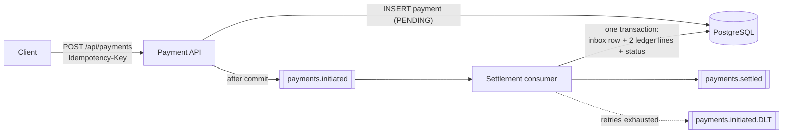

# payments-event-service

An event-driven payment settlement service built with **Java 21, Spring Boot 3, Apache Kafka and PostgreSQL**.
It accepts payments over a REST API, publishes them to Kafka, and settles them asynchronously by
posting double-entry ledger lines — with **exactly-once effects** even though Kafka only guarantees
at-least-once delivery.

The design mirrors the patterns used in real banking and payment platforms: idempotency keys on the
write API, a transactional inbox on the consumer, ordered partitions per payment, and a dead-letter
topic for poison messages.

[](https://github.com/eklavyachamp28/payments-event-service/actions/workflows/ci.yml)

## Architecture



**Flow**

1. `POST /api/payments` with an `Idempotency-Key` header stores the payment as `PENDING`.
   Replaying the same key returns the original payment (`200`) instead of creating another (`201`).
2. After the database transaction commits, a `PaymentInitiated` event is published, keyed by payment id
   so every event for one payment lands on the same partition and stays ordered.
3. The settlement consumer runs **one transaction** that inserts the event id into `processed_events`,
   posts a `DEBIT` on the customer account and a `CREDIT` on the merchant account, and marks the payment
   `SETTLED`. A redelivered event finds the inbox row and is skipped, so the ledger is never double-posted.
4. A `PaymentSettled` event is published for downstream systems (notifications, reporting, …).
5. Failures retry with exponential backoff (200 ms → ~5 s); non-retryable or exhausted records go to a
   dead-letter topic so a poison message never blocks the partition.

## Why these choices

| Concern | Decision |
|---|---|
| Duplicate client retries | `Idempotency-Key` + unique index; a concurrent race is resolved by re-reading the winner's row |
| Duplicate Kafka deliveries | Transactional inbox (`processed_events` keyed by event id) in the same transaction as the ledger write |
| Lost events on crash | Event is published only in `afterCommit`, so a consumer can never see a payment that doesn't exist |
| Ordering | Producer key = payment id → single partition per payment |
| Poison messages | `DefaultErrorHandler` with exponential backoff + `DeadLetterPublishingRecoverer` |
| Auditability | Double-entry ledger; debits always equal credits per payment (asserted in tests) |
| Schema safety | Flyway migrations + Hibernate `ddl-auto: validate` (catches entity/schema drift at startup) |

## Run it

```bash
docker compose up --build
# then
curl -X POST localhost:8080/api/payments \
  -H 'Content-Type: application/json' -H 'Idempotency-Key: order-1001' \
  -d '{"merchantId":"merchant-42","customerId":"customer-7","amount":1499.00,"currency":"INR"}'
curl localhost:8080/api/payments/<id>      # PENDING -> SETTLED within a second
```

Swagger UI: `http://localhost:8080/swagger-ui.html` · Health: `http://localhost:8080/actuator/health`

## Tests

```bash
mvn verify
```

- `SettlementServiceTest` — unit tests for duplicate / already-final / happy-path settlement.
- `PaymentFlowIT` — end-to-end test on **embedded Kafka** and an in-memory PostgreSQL-mode database
  (no Docker needed): REST → Kafka → settlement, ledger balance, idempotent replay, redelivered events,
  and validation errors.

## Project layout

```
src/main/java/com/aayusheklavya/payments
├── api/        REST controller, request/response records, ProblemDetail error handling
├── domain/     JPA entities (Payment, LedgerEntry, ProcessedEvent) and repositories
├── events/     Event records, topics, publisher, Kafka consumer
├── service/    PaymentService (idempotent create), SettlementService (transactional settlement)
└── config/     Topics, retry/DLT error handler
src/main/resources/db/migration   Flyway schema
```

## Roadmap

- [ ] Outbox table + Debezium instead of `afterCommit` publishing, for guaranteed delivery across crashes
- [ ] Refund flow (`PaymentRefundRequested` → compensating ledger lines)
- [ ] Prometheus metrics for settlement latency and DLT volume
- [ ] Helm chart for Kubernetes deployment
